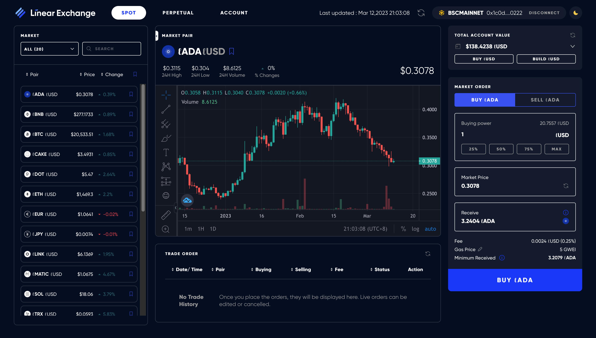

# System overview

This page provides a _high-level_ overview of the entire Linear Finance system. See other pages for more technical details.

## Overview

At its core, Linear is a synthetic asset protocol deployed on Ethereum and Binance Smart Chain (see [History](#history) for more context). A group of users identified as "builders" stake collateral tokens (only the native currency `LINA` was supported as collateral before the multi-collateral upgrade) to mint a token called `lUSD`, and by doing so they incur "debt", which is collectively referred to as the "debt pool". `lUSD` can be exchanged into different synthetic assets called "liquids" by another group of users identified as "traders" (a user can be a "builder" and a "trader" at the same time). By making trades, "traders" make profits or losses, which are then absorbed by the "debt pool" in the form of debt changes. The platform charges fees for the trades, which are then distributed back to the "builders" for the risk taken.

Here's a high-level diagram illustrating the process:

_([Buildr](#buildr) and [Exchange](#exchange) are 2 dapps operated by Linear. See the [Dapps](#dapps) section for more details.)_

## User incentives

Out of the 2 groups of users described in [Overview](#overview), it's clear that "traders" don't take on any risk apart from their own trading decisions. On the other hand, "builders" incurs the risk of bearing losses (in the form of debt increases) when "traders" make profits. Therefore, it's necessary to incentivize "builders" for minting the `lUSD` token. Currently, this is done through a _Weekly Staking Rewards_ mechanism, with rewards coming from:

- a pre-defined reward schedule in `LINA` tokens; and
- fees collected from trading over the last week in `lUSD` tokens.

For more details on _Weekly Staking Rewards_, check out [this page](./08_weekly_staking_rewards.md).

## History

_This section is mostly irrelevant to the technical details, but rather to provide context. Feel free to skip this section._

The Linear protocol was initially developed by its original team. It was designed to work on two chains at the same time with a synchronized debt pool. At around December 2020, that team was preparing for the launch on Ethereum. That's when the second development team (the team that's actually writing the docs you're reading right now; "the team" hereafter) took over. The codebase produced by the original team was considered by the team to be of poor quality and hard to maintain. The team made some last minute adjustments but wasn't able to perform a full overhaul of the smart contracts due to time constraint, which is why you'll still see lots of legacy code in the contracts.

The team proceeded to deploy and launch the protocol on Ethereum. At the time, only contracts for supporting [Buildr](#buildr) were deployed. Users were able to stake `LINA` and build `lUSD` on Ethereum but not trade them into other synthetic assets.

That's when the team discovered that the original design of sharing a single debt pool was infeasible in practice. The core team was informed and decided to migrate the platform entirely onto BSC, leaving only the token contracts on Ethereum.

Therefore, the team:

- Deployed the same set of contracts together with the ones that power the [Exchange](#exchange) dapp to BSC.
- Developed and deployed an ERC20 token bridge between Ethereum and BSC.
- Paused all the contracts on Ethereum.
- Migrated all user data into the BSC contracts.

As a result, the only contracts on Ethereum that are still operational today are the token contracts.

## Architecture

In terms of architecture, Linear operates much like any other dapps. Here's a (simplified) diagram illustrating the main components of the system:

The steps below describes what happens when a user performs an action in a Linear dapp:

1. The user interacts with the web app, checks data displayed, and decides on action;
2. The user signs a transaction and sends it to a smart contract on-chain;
3. _(Optional)_ In some cases, an off-chain server is used to send out transactions under certain conditions;
4. The contract processes the incoming call and emits events;
5. The Graph picks up the events through a blockchain node via RPC, and indexes the events;
6. The web app fetches updated data through a GraphQL interface exposed by The Graph, and displays it to the user.

## Dapps

This section lists Linear dapps in chronological order by which they were launched. "Dapps" here refer to web applications that enable users to interact witb smart contracts. For documentation on the actual underlying contracts, check out the [Smart contracts](./02_smart_contracts.md) page.

Linear currently operates 5 dapps:

- [Buildr](#buildr)
- [Exchange](#exchange)
- [Dashboard](#dashboard)
- [Vault](#vault)
- [Debt Terminator](#debt-terminator)

### Buildr

Useful links:

- [Dapp](https://buildr.linear.finance/)
- [Repository](https://github.com/Linear-finance/linear-buildr)

Buildr is the front-end portal for "builders" to:

- manage collaterals (stake & unstake);
- mint `lUSD` or burn debt with `lUSD`;
- check and claim [weekly staking rewards](./08_weekly_staking_rewards.md);
- send supported tokens between Ethereum and BSC through the token bridge.

### Exchange

Useful links:

- [Dapp](https://exchange.linear.finance/)
- [Repository](https://github.com/Linear-finance/linear-exchange)

Exchange is the front-end portal for "traders" to:

- make spot trades to convert their synthetic assets (e.g. `lUSD`) into another one;
- make perpetual trades to enter into futures position to long or short any supported asset.

### Dashboard

Useful links:

- [Dapp](https://dashboard.linear.finance/)
- [Repository](https://github.com/Linear-finance/linear-dashboard)

Dashboard is a read-only web application to provide analytical data of the protocol.

### Vault

Useful links:

- [Dapp](https://vault.linear.finance/)
- [Repository](https://github.com/Linear-finance/linear-vault)

Vault is a front-end application for users to interact with the staking pools for incentivizing the maintenance of the [lUSD-USD peg](./09_lusd_usd_peg.md).

### Debt Terminator

Useful links:

- [Dapp](https://debt-terminator.linear.finance/)
- [Repository](https://github.com/Linear-finance/linear-liquidation-portal)

Debt Terminator is a front-end portal for performing [liquidations](./06_debt_pool.md#liquidation) against unhealthy debt positions held by "builders".
